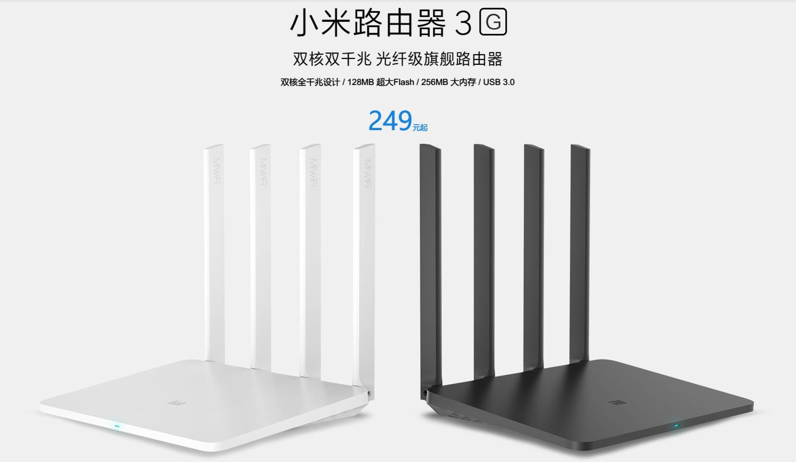

# R3G ([小米路由器3G](https://item.mi.com/product/5825.html))

### 背景

搬家... 忘记哪一年的电信日, 全局网络提速.  
在自如租的房子, 带宽也从原来的50M升级到250M(为啥是这个数...).

### 购买渠道

万能的淘宝 (全新)

### 选购缘由

带宽升级之后, 原来的 `K2` 明显满足不了带宽上限.  
在论坛蹲了几天之后, 选择了 `R3G`.  

### 以下为折腾经历

- 官方固件  
  没啥好说的, 当时只是为了有个能远程管理, 每天简单用用就完事了.

- 官改固件  
  其实也不能算是官改, 只不过是在官方固件的基础上添加了插件中心.  

- 潘多拉固件  
  在用了大概2个月的官方+官改固件之后, 下定决心放弃保修, 刷第三方固件.  
  潘多拉是基于`OpenWRT`的一个固件, 有 `OpenWRT` 强大的生态保障.  
  刷机简易教程  
  1. 解锁官方BootLoader. 在小米官网绑定你的设备, 然后解锁. (具体过程自行搜索)
  2. 刷入升级版固件
  3. 开启 `telnet`, 备份硬件数据.
  4. 刷入第三方引导 ([Breed](https://breed.hackpascal.net/))
  5. 按住 `Reset` 键并插入电源开机.
  6. 固定本地电脑IP为 192.168.1.2, 打开浏览器地址: 192.168.1.1
  7. 刷新的固件, 等待重启.
