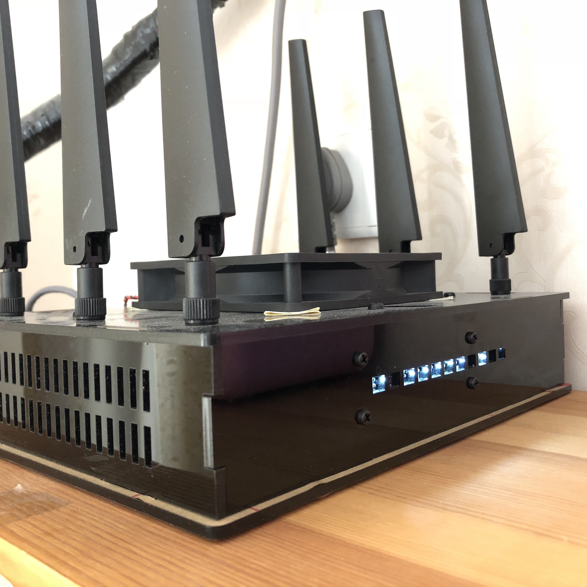
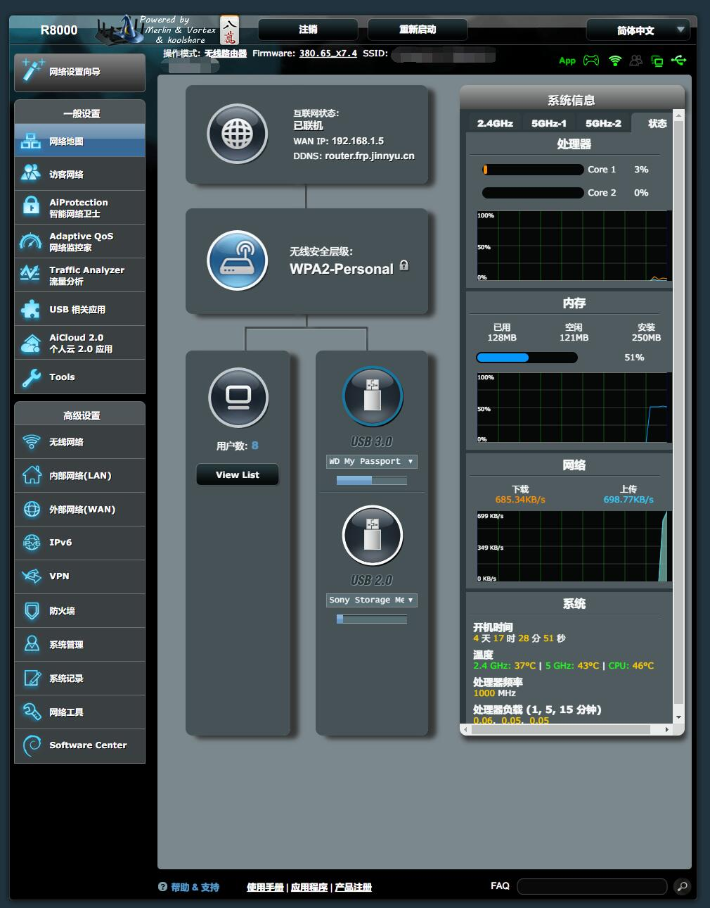

# R8000 ([网件 夜鹰X6 AC3200](https://www.netgear.com.cn/home/products/networking/wifi-routers/R8000.aspx))

### 背景

2018年11月, 父母家中网络到期, 升级至联通200M宽带.

### 购买渠道

万能的淘宝 (二手)

### 选购缘由

之前一直用的都是```MTK```的路由器, 在恩山论坛也混迹了有1年多的时间,  
经常看到网友说梅林固件怎么怎么好, 心里长草, 正好加上父母需要千兆路由器, 之前免费撸的斐迅K2不够用了,  
所以就借着这个理由就换了个```R8000```.

### 以下为折腾经历

1. 因为```R8000```上市时间不短了, 所以购买全新的有点不合适, 故选择了二手 (说白了还是没钱...)
2. 当时购买的是拆机产品, 卖家搭配了一套亚克力的外壳.  
   个人觉得比原装的外壳好看(天线除外), 而且可以加风扇, 这样基本上解决了发热量大的问题.  
   原装
   淘宝
3. 运行截图
   环境室温 稳定在20°左右 路由整体温度在可接受的范围内,  
   风扇供电(5V)走的是板子上的3.3V供电, 所以相当于变相降速, 噪音基本上听不见.  
   截图
4. 添加不可描述插件  
   17年的一段时间, 国家对于梯子类软件查的比较严, 所以导致很多固件都去掉了梯子类的集成.  
   机器到手后, 默认集成软件中心, 但是版本基本上不能用, 所以先更新软件中心.  
   因为梅林固件支持离线安装, 所以搜到一个离线安装包, 之后直接在软件中心离线安装即可.
   剩下的就是配置节点, 不做不表述.